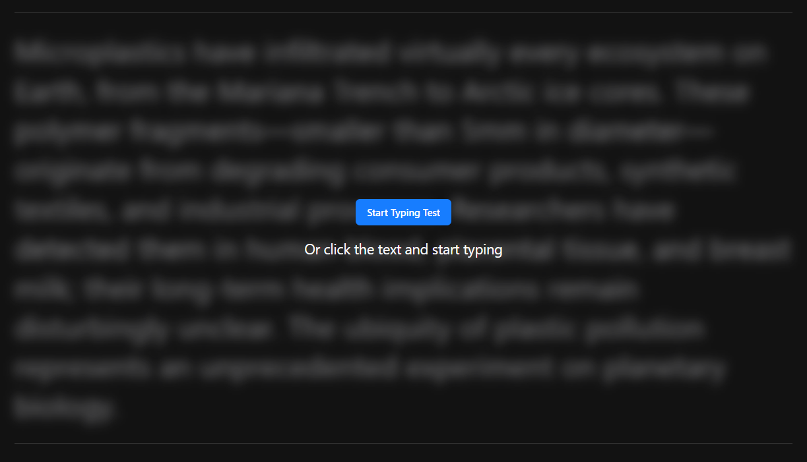

# Frontend Mentor - Typing Speed Test


## Welcome! 👋

Thanks for checking out this coding challenge from [Frontend Mentor](https://www.frontendmentor.io)!

## My tech stack 🛠️


I knew I'd be using TypeScript and Tailwind CSS as those are my go-to's. But I did second guess React for a moment or two, before deciding it would be great for all the DOM updates this project has going on.

I was excited to use **Shadcn** as I'd finally used it on my last project and really wanted to dive into the internals of other components. In this project I used Button, Dropdown Menu and Toggle Group.

## The challenge

The challenge was to build out this typing speed test app and get it looking as close to the design as possible.

Users should be able to:

#### Test Controls

- Start a test by clicking the start button or by clicking the passage and typing
- Select a difficulty level (Easy, Medium, Hard) for passages of varying complexity
- Switch between "Timed (60s)" mode and "Passage" mode (timer counts up, no limit)
- Restart at any time to get a new random passage from the selected difficulty

#### Typing Experience

- See real-time WPM, accuracy, and time stats while typing
- See visual feedback showing correct characters (green), errors (red/underlined), and cursor position
- Correct mistakes with backspace (original errors still count against accuracy)

#### Results & Progress

- View results showing WPM, accuracy, and characters (correct/incorrect) after completing a test
- See a "Baseline Established!" message on their first test, setting their personal best
- See a "High Score Smashed!" celebration with confetti when beating their personal best
- Have their personal best persist across sessions via localStorage

#### UI & Responsiveness

- View the optimal layout depending on their device's screen size
- See hover and focus states for all interactive elements

### Data Model

A `data.json` file is provided with passages organized by difficulty. Each passage has the following structure:

```json
{
  "id": "easy-1",
  "text": "The sun rose over the quiet town. Birds sang in the trees as people woke up and started their day."
}
```

| Property | Type   | Description                                                               |
| -------- | ------ | ------------------------------------------------------------------------- |
| `id`     | string | Unique identifier for the passage (e.g., "easy-1", "medium-3", "hard-10") |
| `text`   | string | The passage text the user will type                                       |

### Expected Behaviors

- **Starting the test**: The timer begins when the user starts typing or clicks the start button. Clicking directly on the passage text and typing also initiates the test
- **Timed mode**: 60-second countdown. Test ends when timer reaches 0 or passage is completed
- **Passage mode**: Timer counts up with no limit. Test ends when the full passage is typed
- **Error handling**: Incorrect characters are highlighted in red with an underline. Backspace allows corrections, but errors still count against accuracy
- **Results logic**:
  - First completed test: "Baseline Established!" - sets initial personal best
  - New personal best: "High Score Smashed!" with confetti animation
  - Normal completion: "Test Complete!" with encouragement message

### Data Persistence

The personal best score should persist across browser sessions using `localStorage`. When a user beats their high score, the new value should be saved and displayed on subsequent visits.

## My Challenges

### Styling the radial button for the mobile dropdowns

I loved using [Shadcn](https://ui.shadcn.com/) for UI elements in my last project and wanted to get some more experience customizing it.

The **Radio Group** variant of their **Dropdown Menu** was _almost_ perfect. The only issue was the radios themselves!

By default they had a solid-looking  circle for the selected item. Alas, that didn't match the design!

I noticed it had a `<Circle></Circle>` element with the property `fill="currentColor"`, I tried switching that to the Tailwind CSS blue color, but it was missing the 'black inside'. I tried using `bg-radial`, but that completely broke it.

Fortunately, Shadcn let's you mess with the internals, so I found the `Circle` was imported from `lucide-react`. I Googled that and found where I could modify it and copy the result directly in `components/ui/dropdown-menu`!


### Dealing with all those vertical dividers

_I'm still a bit of a loss here, as I got things working, but only working-ish!_

In my `Stats` component, I was able to use `border-l` and `border-r` as expected, but it was difficult to get them to line exactly up as the design requires. I added these borders to the middle item and switched from `flex` to `grid`, but they are still at little off. I used the `spacing` specs from the Design System in Figma, but found I'd have to **magic number** it a bit more than I was comfortable with. In the end, it works and doesn't really affect the UX.

I used a _very hacky_ solution in my `SettingsLargeScreens` component. I started trying to add a `-border-r` to one of the `<ToggleGroup>`s, but it didn't immediately appear. So, I got this _silly idea_ of styling a `|` instead. This worked really well so I let it be.

## Intentional design changes

I decided to add a **horizontal line** at the bottom of the **Not Started** screen rather than just the top as it felt more consistent.

I also had my `handleClick` on the entire area to remove the text blur when the user decided to Start Typing Test.

This increases the UX as they know _where_ they can click.



## Got feedback for us?

We love receiving feedback! We're always looking to improve our challenges and our platform. So if you have anything you'd like to mention, please email hi[at]frontendmentor[dot]io.

This challenge is completely free. Please share it with anyone who will find it useful for practice.

**Have fun building!** 🚀
