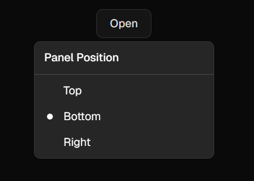
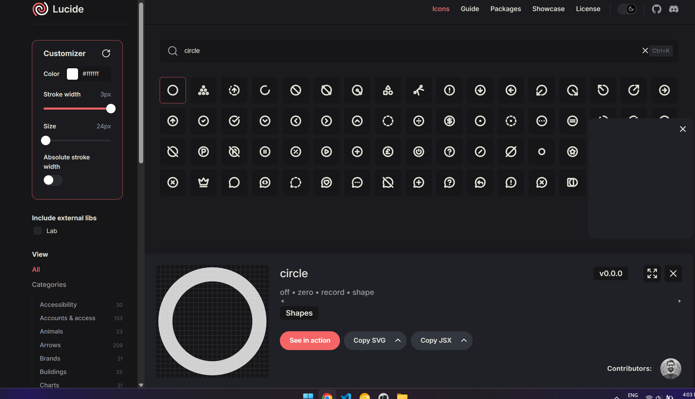

# Frontend Mentor - Typing Speed Test


## Welcome! 👋

Thanks for checking out this coding challenge from [Frontend Mentor](https://www.frontendmentor.io)!

## The challenge

The challenge was to build out this typing speed test app and get it looking as close to the design as possible.

Users should be able to:

#### Test Controls

- Start a test by clicking the start button or by clicking the passage and typing
- Select a difficulty level (Easy, Medium, Hard) for passages of varying complexity
- Switch between "Timed (60s)" mode and "Passage" mode (timer counts up, no limit)
- Restart at any time to get a new random passage from the selected difficulty

#### Typing Experience

- See real-time WPM, accuracy, and time stats while typing
- See visual feedback showing correct characters (green), errors (red/underlined), and cursor position
- Correct mistakes with backspace (original errors still count against accuracy)

#### Results & Progress

- View results showing WPM, accuracy, and characters (correct/incorrect) after completing a test
- See a "Baseline Established!" message on their first test, setting their personal best
- See a "High Score Smashed!" celebration with confetti when beating their personal best
- Have their personal best persist across sessions via localStorage

#### UI & Responsiveness

- View the optimal layout depending on their device's screen size
- See hover and focus states for all interactive elements

### Data Model

A `data.json` file is provided with passages organized by difficulty. Each passage has the following structure:

```json
{
  "id": "easy-1",
  "text": "The sun rose over the quiet town. Birds sang in the trees as people woke up and started their day."
}
```

| Property | Type | Description |
| --- | --- | --- |
| `id` | string | Unique identifier for the passage (e.g., "easy-1", "medium-3", "hard-10") |
| `text` | string | The passage text the user will type |

### Expected Behaviors

- **Starting the test**: The timer begins when the user starts typing or clicks the start button. Clicking directly on the passage text and typing also initiates the test
- **Timed mode**: 60-second countdown. Test ends when timer reaches 0 or passage is completed
- **Passage mode**: Timer counts up with no limit. Test ends when the full passage is typed
- **Error handling**: Incorrect characters are highlighted in red with an underline. Backspace allows corrections, but errors still count against accuracy
- **Results logic**:
  - First completed test: "Baseline Established!" - sets initial personal best
  - New personal best: "High Score Smashed!" with confetti animation
  - Normal completion: "Test Complete!" with encouragement message

### Data Persistence

The personal best score should persist across browser sessions using `localStorage`. When a user beats their high score, the new value should be saved and displayed on subsequent visits.


## My Challenges


## Building your project

### Styling the radial button for the mobile dropdowns

I loved using [Shadcn](https://ui.shadcn.com/) for UI elements in my last project and wanted to get some more experience customizing it.

The **Radio Group** variant of their **Dropdown Menu** was *almost* perfect.  The only issue was the radios themselves!

By default they had a solid-looking  circle for the selected item.  Alas, that didn't match the design!

I noticed it had a `<Circle></Circle>` element with the property `fill="currentColor"`, I tried switching that to the Tailwind CSS blue color, but it was missing the 'black inside'. I tried using `bg-radial`, but that completely broke it.

Fortunately, Shadcn let's you mess with the internals, so I found the `Circle` was imported from `lucide-react`. I Googled that and found where I could modify it and copy the result directly in `components/ui/dropdown-menu`!



## Create a custom `README.md`

We strongly recommend overwriting this `README.md` with a custom one. We've provided a template inside the [`README-template.md`](./README-template.md) file in this starter code.

The template provides a guide for what to add. A custom `README` will help you explain your project and reflect on your learnings. Please feel free to edit our template as much as you like.

Once you've added your information to the template, delete this file and rename the `README-template.md` file to `README.md`. That will make it show up as your repository's README file.

## Submitting your solution

Submit your solution on the platform for the rest of the community to see. Follow our ["Complete guide to submitting solutions"](https://medium.com/frontend-mentor/a-complete-guide-to-submitting-solutions-on-frontend-mentor-ac6384162248) for tips on how to do this.

Remember, if you're looking for feedback on your solution, be sure to ask questions when submitting it. The more specific and detailed you are with your questions, the higher the chance you'll get valuable feedback from the community.

## Sharing your solution

There are multiple places you can share your solution:

1. Share your solution page in the **#finished-projects** channel of our [community](https://www.frontendmentor.io/community). 
2. Tweet [@frontendmentor](https://twitter.com/frontendmentor) and mention **@frontendmentor**, including the repo and live URLs in the tweet. We'd love to take a look at what you've built and help share it around.
3. Share your solution on other social channels like LinkedIn.
4. Blog about your experience building your project. Writing about your workflow, technical choices, and talking through your code is a brilliant way to reinforce what you've learned. Great platforms to write on are [dev.to](https://dev.to/), [Hashnode](https://hashnode.com/), and [CodeNewbie](https://community.codenewbie.org/).

We provide templates to help you share your solution once you've submitted it on the platform. Please do edit them and include specific questions when you're looking for feedback. 

The more specific you are with your questions the more likely it is that another member of the community will give you feedback.

## Got feedback for us?

We love receiving feedback! We're always looking to improve our challenges and our platform. So if you have anything you'd like to mention, please email hi[at]frontendmentor[dot]io.

This challenge is completely free. Please share it with anyone who will find it useful for practice.

**Have fun building!** 🚀
